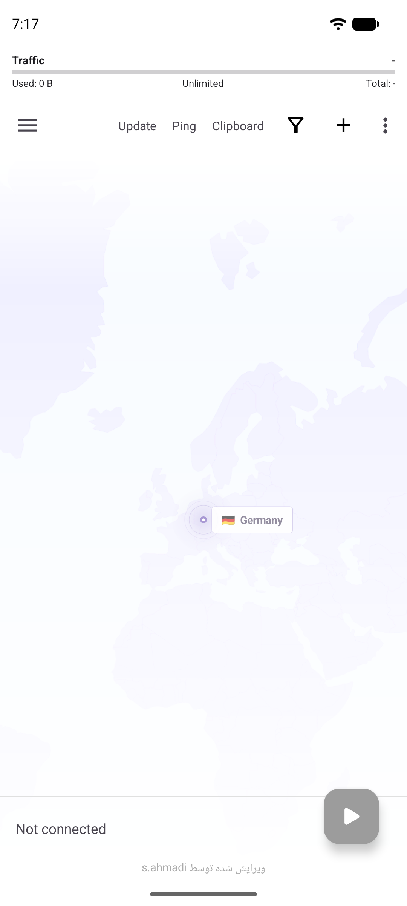
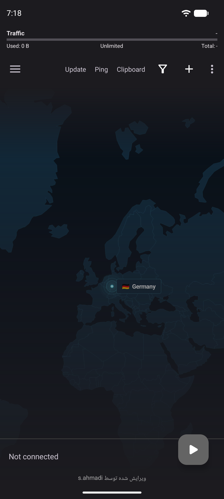

# v2rayNG Modified

اولین ویرایش v2ray با نوار مصرف ترافیک و نقشهٔ زندهٔ سینمایی VPN

نسخهٔ شخصی‌سازی‌شدهٔ v2rayNG با قابلیت‌های اضافه، از جمله نمایش زندهٔ نقشه و موقعیت اتصال VPN

Personalized v2rayNG with additional features

## Screenshots

| Light theme | Dark theme |
| --- | --- |
|  |  |

---

## تغییرات / Changes

### v2.5.7 — Smooth map rendering

- حذف رندر هم‌زمان چند کش بزرگ نقشه در زمان حرکت
- بهینه‌سازی دنبالهٔ Marker و کاهش ایجاد Shader در هر فریم برای حرکت روان‌تر

### v2.5.7 — Smooth map rendering

- Removed multi-texture map compositing while moving
- Optimized the marker trail to reduce per-frame shader creation and improve smoothness

### v2.5.6 — Cinematic VPN World Map

- نقشهٔ زندهٔ جهان بر پایهٔ داده‌های واقعی کشورها، نه تصویر پس‌زمینهٔ ثابت
- تشخیص کشور IP عمومی در حالت قطع اتصال و نمایش کشور سرور در حالت اتصال
- نشانگر زنده با پرچم و نام کشور، پالس، حلقه‌های نورانی و دنبالهٔ داده
- حرکت نرم دوربین: ابتدا نقشه به مقصد می‌رود و سپس نشانگر اتصال حرکت می‌کند
- زوم تطبیقی 3× با کش چندسطحی برای حفظ کیفیت نقشه و جلوگیری از پرش یا بارگذاری دوباره
- بهینه‌سازی رندر: لایهٔ ثابت نقشه کش می‌شود و فقط لایه‌های انیمیشنی در هر فریم به‌روزرسانی می‌شوند

### v2.5.6 — Cinematic VPN World Map

- Live world map based on real country geometry, not a static background image
- Public-IP country while disconnected; selected server country while connected
- Live endpoint with country flag/name, pulse, radar rings, glow, and a data trail
- Cinematic motion: the camera travels first, then the connection node follows
- Adaptive 3× zoom with multi-level map caching for crisp detail without reload flashes
- Cached static map layer; only animated effects redraw per frame for smoother performance

- سه دکمه در نوار بالا: بروزرسانی، پینگ، افزودن از کلیپ‌بورد
- حذف اشتراک پیش‌فرض هنگام نصب اولیه
- دکمه گزارش باگ در منوی کشویی
- آپدیت خودکار اشتراک‌ها هنگام باز شدن برنامه
- نمایش نوار مصرف ترافیک در بالای صفحه (مخصوص هر گروه/ساب)
- نمایش درصد مصرف، حجم مصرف شده، حجم باقی مانده، کل ترافیک و روزهای باقی مانده
- بررسی خودکار آپدیت روزانه از گیت‌هاب

- Three buttons in toolbar: Update Subscription, Ping All, Add from Clipboard
- Removed default subscription on fresh install
- Bug Report button in drawer menu
- Auto update subscriptions on app open
- Traffic usage bar at the top (per group/subscription)
- Show usage percent, used, remaining, total traffic and days left
- Auto daily update check from GitHub

---

## دریافت / Download

به بخش [Releases](https://github.com/sirvan1133/v2rayNG-modified/releases) مراجعه کنید.

See [Releases](https://github.com/sirvan1133/v2rayNG-modified/releases) for downloads.

---

## حمایت / Donate

**USDT (BEP20):** `0xAab8aE16283C399e188328b9b06cECCAd47FABDe`

**TRX:** `0xAab8aE16283C399e188328b9b06cECCAd47FABDe`

---

## Source

https://github.com/sirvan1133/v2rayNG-modified

