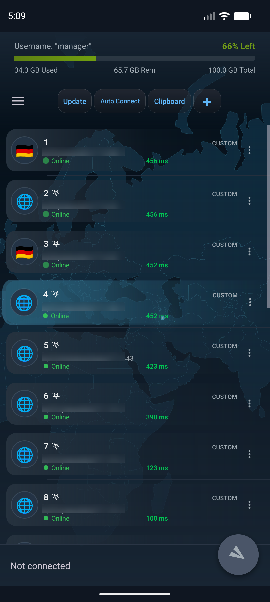
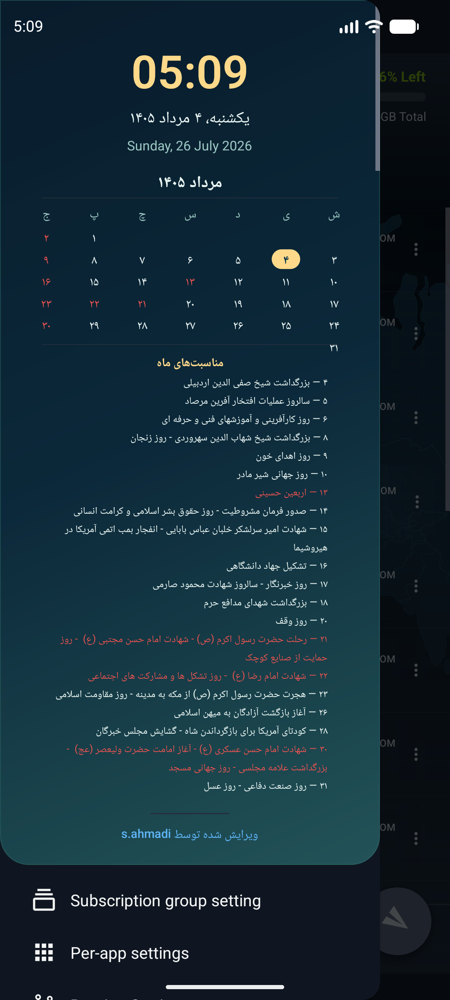
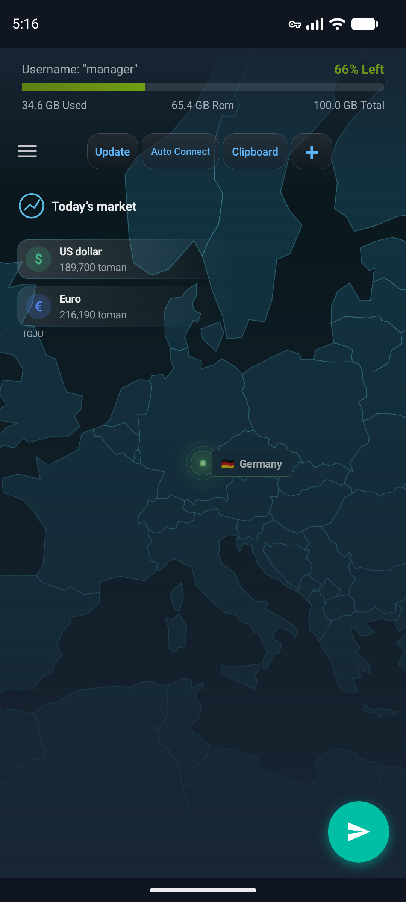
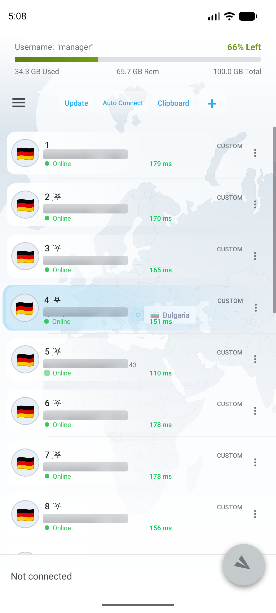
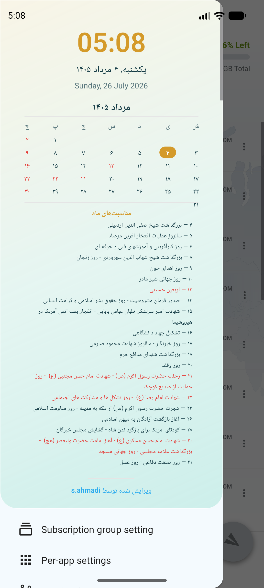
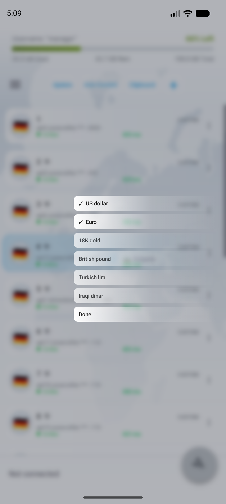

# v2rayNG Modified 

A redesigned and feature-enhanced Android client based on
[v2rayNG](https://github.com/2dust/v2rayNG).

نسخه‌ای بازطراحی‌شده و توسعه‌یافته از v2rayNG برای اندروید.

## Screenshots

<table>
  <tr>
    <td align="center"> Dark home</td>
    <td align="center"> Dark hamburger menu</td>
    <td align="center"> Dark market prices</td>
  </tr>
  <tr>
    <td align="center"> Light home</td>
    <td align="center"> Light hamburger menu</td>
    <td align="center"> Light market prices</td>
  </tr>
</table>

## Added features compared with standard v2rayNG

### Redesigned home screen

- Compact configuration cards with a simple translucent gradient and rounded corners
- Clear animated selection state with a subtle blue outer glow
- Circular country flags resolved automatically from each server IP
- Protocol label, live online state, and latency displayed on every card
- Smooth macOS-style transitions when configurations appear or disappear
- Unified translucent top and per-configuration overflow menus
- Background blur while contextual menus are open
- Redesigned subscription selector and traffic usage bar
- Stable configuration and traffic layout in both Persian and English modes
- Translucent drag state instead of a solid white card while reordering configurations
- Top action panel containing Update, Auto Connect, Clipboard, and overflow actions

### Direct live ping and Auto Connect

- Continuous latency measurement for every configuration
- Ping tests use the physical/default Internet connection instead of the active VPN
  tunnel
- Live ping continues working while the VPN is connected
- Automatic ping recovery after screen lock or returning from the background
- Throttled concurrent measurements to reduce battery and network usage
- **Auto Connect** measures reachable servers and connects to the fastest
  configuration

### Persian calendar and responsive controls

- Live Persian calendar inside the navigation drawer
- Daily occasion and official-holiday data sourced from Bahesab
- Official holidays and their occasion text highlighted in red
- Calendar height adapts automatically to the number and length of occasions
- Smooth once-per-day drawer scroll hint revealing additional settings
- Resolution-aware Add and configuration menus that never leave the visible screen
- Compact borderless tool cards fading from fully solid to transparent
- Subtle system haptics for VPN toggle, Add, configuration menus, and menu actions
- Refined light theme colors, contrast, cards, map, widgets, and popup presentation

### Cinematic vector IP-location map

- High-quality vector world map instead of a static map image
- Animated camera and destination marker when the selected server changes
- Country flag and country name displayed at the destination
- Smooth marker trail and motion effects optimized for weaker devices
- Preloaded map geometry and display lists to reduce movement stutter
- Daily cache for source/public-IP location to improve startup speed
- Correct return to the source location after disconnecting the VPN
- Reliable map restoration when the application returns from the background
- No live GPS-location marker is drawn over the map
- Dark and light appearance support

### Cinematic weather widget

- Animated weather scene displayed when the configuration list is hidden
- Cross-dissolve transitions with a transparent background
- Layered animated clouds with independent depth, speed, and opacity
- Refined sun, temperature, condition, calendar, and location presentation
- Current location displayed beside weather data instead of over the sun or map
- Weather visibility control in the navigation drawer
- Persian and English controls following the selected application language
- Dark and light appearance support

### Currency and market widget

- Lightweight market widget with transparent gradient cards
- Rates sourced from TGJU and refreshed every five minutes
- Text-only refreshes to minimize traffic and battery use
- USD and EUR enabled by default
- Optional GBP, TRY, Iraqi dinar, and gold entries
- Dedicated minimal icon for every rate, including Iraqi dinar
- User-selectable market entries
- Independent layout that does not overlap the weather widget
- Persian and English labels plus dark and light appearance support

### Widget controls

- Custom track-and-thumb switches with gray OFF and green ON states
- Settings appear only while their related widget is enabled
- Weather and IP-location map behavior remain independent
- Localized translucent widget settings interface

### Update and lifecycle reliability

- Automatic GitHub Release update check after application startup
- Update checks limited to once every 24 hours
- Popup displayed only when a newer semantic version is available
- Architecture-aware APK selection for ARM64, ARM32, x86, and x86_64 devices
- Manual update checker retained in the navigation drawer
- Improved recovery after screen lock and backgrounding
- Direct-ping and connection-state recovery without force-closing the application
- Fixes for disappearing map rendering, widget overlap, duplicate weather elements,
  configuration selection, and foreground transitions

## امکانات اضافه‌شده نسبت به v2rayNG معمولی

### صفحه اصلی بازطراحی‌شده

- کارت‌های جمع‌وجور کانفیگ با گرادینت ساده، شفافیت کنترل‌شده و گوشه‌های خم
- نمایش واضح کانفیگ انتخابی با انیمیشن و Glow آبی ملایم به سمت بیرون
- تعیین خودکار پرچم کشور از روی IP هر کانفیگ و نمایش دایره‌ای آن
- نمایش پروتکل، وضعیت آنلاین و پینگ زنده روی هر کارت
- ترنزیشن نرم شبیه macOS برای ظاهر و مخفی‌شدن کانفیگ‌ها
- منوی نیمه‌شفاف و هماهنگ برای سه‌نقطه بالای صفحه و سه‌نقطه کانفیگ‌ها
- تارشدن پس‌زمینه هنگام بازبودن منوها
- بازطراحی انتخاب‌گر اشتراک‌ها و نوار مصرف ترافیک
- ثابت‌ماندن جهت بخش کانفیگ‌ها و ترافیک در زبان فارسی و انگلیسی
- حالت نیمه‌شفاف هنگام جابه‌جایی کانفیگ به‌جای سفیدشدن کامل کارت
- پنل بالایی شامل Update، اتصال خودکار، Clipboard و منوی بیشتر

### تقویم فارسی و کنترل‌های واکنش‌گرا

- تقویم زنده فارسی در منوی همبرگری
- دریافت روزانه مناسبت‌ها و تعطیلی‌های رسمی از «با حساب»
- نمایش قرمز روزهای تعطیل و متن مناسبت آن‌ها
- تغییر خودکار ارتفاع تقویم بر اساس تعداد و طول مناسبت‌ها
- راهنمای اسکرول نرم منوی همبرگری، روزی یک‌بار
- منوهای واکنش‌گرا برای «+» و سه‌نقطه کانفیگ‌ها بدون بیرون‌زدگی از صفحه
- کارت‌های ابزار جمع‌وجور و بدون کادر کلی، با محوشدن کامل به سمت راست
- بازخورد لرزشی ظریف برای کلید VPN، دکمه «+»، سه‌نقطه و گزینه‌های ابزار
- اصلاح کامل رنگ، کنتراست، کارت‌ها، نقشه، ویجت‌ها و پنجره‌ها در تم روشن

### پینگ زنده مستقیم و اتصال خودکار

- تست پیوسته پینگ تمام کانفیگ‌ها
- انجام تست پینگ از اینترنت اصلی گوشی و نه از تونل VPN فعال
- ادامه تست پینگ هنگام روشن‌بودن VPN
- بازیابی خودکار پینگ پس از قفل صفحه یا بازگشت از پس‌زمینه
- محدودسازی تست‌های هم‌زمان برای کاهش مصرف اینترنت و باتری
- گزینه **اتصال خودکار** برای سنجش سرورها و اتصال به سریع‌ترین کانفیگ در دسترس

### نقشه برداری سینمایی لوکیشن IP

- نقشه برداری باکیفیت جهان به‌جای تصویر ثابت
- حرکت انیمیشنی دوربین و نشانگر مقصد هنگام تغییر کانفیگ
- نمایش پرچم و نام کشور در مقصد
- Trail و افکت‌های حرکتی بهینه‌شده برای گوشی‌های ضعیف
- پیش‌بارگذاری هندسه و لایه‌های نقشه برای کاهش لگ
- کش روزانه IP و لوکیشن مبدا برای اجرای سریع‌تر
- بازگشت صحیح نقشه به مبدا پس از خاموش‌شدن VPN
- بازیابی نقشه بعد از برگشت برنامه از پس‌زمینه
- حذف نشانگر GPS زنده از روی نقشه
- پشتیبانی از تم روشن و تاریک

### ویجت سینمایی هواشناسی

- نمایش انیمیشنی هواشناسی هنگام مخفی‌شدن کانفیگ‌ها
- ترنزیشن Cross Dissolve با پس‌زمینه شفاف
- ابرهای چندلایه با عمق، سرعت و شفافیت متفاوت
- طراحی بهتر خورشید، دما، وضعیت هوا، تقویم و نام لوکیشن
- نمایش Current Location کنار اطلاعات هواشناسی و نه روی خورشید یا نقشه
- امکان روشن یا خاموش‌کردن هواشناسی از منوی همبرگری
- کنترل‌های فارسی و انگلیسی هماهنگ با زبان برنامه
- پشتیبانی از تم روشن و تاریک

### ویجت قیمت ارز و طلا

- کارت‌های مینیمال با گرادینت شفاف
- دریافت نرخ‌ها از TGJU و بروزرسانی هر پنج دقیقه
- بروزرسانی فقط متن قیمت‌ها برای کاهش مصرف اینترنت و باتری
- نمایش پیش‌فرض دلار و یورو
- امکان افزودن پوند، لیر ترکیه، دینار عراق و طلا
- آیکون مینیمال اختصاصی برای هر مورد، از جمله دینار عراق
- امکان انتخاب ارزهای قابل نمایش
- جلوگیری از هم‌پوشانی ویجت قیمت‌ها و هواشناسی
- پشتیبانی فارسی، انگلیسی و تم روشن و تاریک

### کنترل ویجت‌ها

- سوییچ سفارشی Track/Thumb با بدنه خاکستری در حالت خاموش و سبز در حالت روشن
- نمایش تنظیمات هر ویجت فقط هنگام فعال‌بودن همان ویجت
- مستقل‌بودن رفتار هواشناسی و نقشه لوکیشن IP
- رابط نیمه‌شفاف و بومی‌سازی‌شده تنظیمات ویجت‌ها

### بروزرسانی و پایداری

- بررسی خودکار GitHub Release بعد از اجرای برنامه
- محدودشدن بررسی آپدیت به حداکثر یک‌بار در هر ۲۴ ساعت
- نمایش پاپ‌آپ فقط هنگام وجود نسخه جدیدتر
- انتخاب خودکار APK متناسب با معماری دستگاه
- حفظ بخش بررسی دستی آپدیت در منوی همبرگری
- بازیابی بهتر برنامه پس از قفل صفحه و بازگشت از پس‌زمینه
- بازیابی پینگ و وضعیت اتصال بدون نیاز به بستن اجباری برنامه
- رفع مشکلات محوشدن نقشه، هم‌پوشانی ویجت‌ها، تکرار عناصر هواشناسی، انتخاب کانفیگ
  و ترنزیشن‌های برنامه
